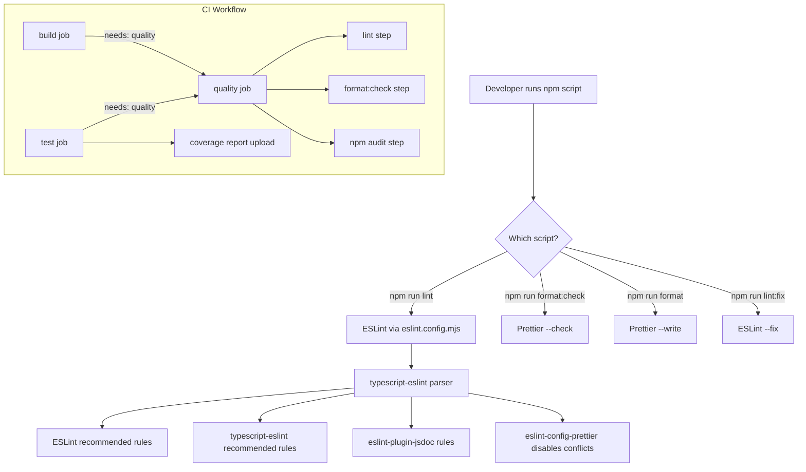

# Design Document: ESLint & Prettier Integration

## Overview

This design integrates ESLint (with TypeScript-aware linting and JSDoc enforcement) and Prettier (for code formatting) into the existing npm workspaces monorepo. The approach uses a single root-level ESLint flat config (`eslint.config.mjs`) and root-level Prettier config (`.prettierrc` + `.prettierignore`) that apply uniformly to all workspaces. `eslint-config-prettier` disables formatting-related ESLint rules to prevent conflicts. The CI workflow gains a new `quality` job that gates the existing `test` and `build` jobs, and the `test` job uploads coverage artifacts.

### Design Decisions

1. **Root-only configuration** — All ESLint/Prettier config lives at the monorepo root. No workspace-level config files. This avoids duplication and ensures consistency.
2. **ESLint flat config format** — Uses `eslint.config.mjs` (ESM) which is the modern standard for ESLint 9+. The `typescript-eslint` package provides a `tseslint.config()` helper for composing typed configs.
3. **Separate tools, not eslint-plugin-prettier** — Prettier runs independently via `prettier --check` rather than as an ESLint plugin. This is the [recommended approach](https://prettier.io/docs/en/integrating-with-linters.html) for performance and clarity. `eslint-config-prettier` simply disables conflicting rules.
4. **Quality job gates downstream** — The new `quality` job (lint + format check + audit) must pass before `test` and `build` run, providing fast feedback on style/security issues.

## Architecture



### File Layout

```text
actions/                          (monorepo root)
├── eslint.config.mjs             ← NEW: ESLint flat config
├── .prettierrc                   ← NEW: Prettier options
├── .prettierignore               ← NEW: Prettier ignore patterns
├── package.json                  ← MODIFIED: new scripts + devDependencies
├── .github/workflows/ci.yml      ← MODIFIED: quality job, coverage artifacts
├── tsconfig.base.json            (unchanged)
├── vitest.workspace.ts           (unchanged)
└── [workspaces...]               (unchanged — no workspace-level lint/format config)
```

## Components and Interfaces

### 1. ESLint Flat Config (`eslint.config.mjs`)

The config is an array of config objects composed via `tseslint.config()`:

```javascript
// eslint.config.mjs
import eslint from '@eslint/js';
import tseslint from 'typescript-eslint';
import jsdoc from 'eslint-plugin-jsdoc';
import eslintConfigPrettier from 'eslint-config-prettier';

export default tseslint.config(
  // Global ignores
  { ignores: ['**/dist/**', '**/node_modules/**', '**/coverage/**'] },

  // Base recommended rules
  eslint.configs.recommended,

  // TypeScript-aware recommended rules
  ...tseslint.configs.recommended,

  // TypeScript files configuration
  {
    files: [
      'extract-dotnet-version/src/**/*.ts',
      'extract-dotnet-version/__tests__/**/*.ts',
      'check-release-version/src/**/*.ts',
      'check-release-version/__tests__/**/*.ts',
      'generate-release-notes/src/**/*.ts',
      'generate-release-notes/__tests__/**/*.ts',
      'packages/lib/src/**/*.ts',
      'packages/lib/__tests__/**/*.ts',
    ],
    languageOptions: {
      parserOptions: {
        projectService: true,
        tsconfigRootDir: import.meta.dirname,
      },
    },
  },

  // JSDoc enforcement for src/ files only
  {
    files: [
      'extract-dotnet-version/src/**/*.ts',
      'check-release-version/src/**/*.ts',
      'generate-release-notes/src/**/*.ts',
      'packages/lib/src/**/*.ts',
    ],
    plugins: { jsdoc },
    rules: {
      'jsdoc/require-jsdoc': ['error', {
        require: { FunctionDeclaration: true, ClassDeclaration: true },
        contexts: [
          'ExportNamedDeclaration > FunctionDeclaration',
          'ExportNamedDeclaration > ClassDeclaration',
          'ExportNamedDeclaration > TSInterfaceDeclaration',
          'ExportDefaultDeclaration > FunctionDeclaration',
          'ExportDefaultDeclaration > ClassDeclaration',
        ],
        checkConstructors: false,
      }],
      'jsdoc/require-param': 'error',
      'jsdoc/require-returns': 'error',
      'jsdoc/require-description': ['error', { descriptionStyle: 'body' }],
    },
  },

  // Disable JSDoc rules for test files
  {
    files: ['**/__tests__/**/*.ts'],
    rules: {
      'jsdoc/require-jsdoc': 'off',
      'jsdoc/require-param': 'off',
      'jsdoc/require-returns': 'off',
      'jsdoc/require-description': 'off',
    },
  },

  // Prettier compat — MUST be last
  eslintConfigPrettier,
);
```

**Key design choices:**

- `projectService: true` enables typed linting using typescript-eslint's project service (auto-discovers tsconfig files)
- JSDoc rules target only `src/` directories, not `__tests__/`
- `eslintConfigPrettier` is the final entry to override any formatting rules from earlier configs
- Type aliases are not targeted by `jsdoc/require-jsdoc` contexts (only functions, classes, interfaces)

### 2. Prettier Configuration (`.prettierrc`)

```json
{
  "printWidth": 100,
  "tabWidth": 2,
  "useTabs": false,
  "semi": true,
  "singleQuote": true,
  "trailingComma": "all",
  "bracketSpacing": true,
  "arrowParens": "always"
}
```

### 3. Prettier Ignore (`.prettierignore`)

```text
dist/
node_modules/
package-lock.json
coverage/
```

### 4. NPM Scripts (root `package.json` additions)

```json
{
  "scripts": {
    "lint": "eslint .",
    "lint:fix": "eslint . --fix",
    "format": "prettier --write \"**/*.ts\"",
    "format:check": "prettier --check \"**/*.ts\""
  }
}
```

The `eslint .` command uses the flat config's `files` patterns to determine scope. Prettier uses its own glob and `.prettierignore` for exclusions.

### 5. CI Workflow Modifications

The `ci.yml` gains a `quality` job and the `test`/`build` jobs gain `needs: [quality]`:

```yaml
jobs:
  quality:
    name: Quality
    runs-on: ubuntu-latest
    steps:
      - uses: actions/checkout@v4
      - uses: actions/setup-node@v4
        with:
          node-version: 20
      - uses: actions/cache@v4
        with:
          path: ~/.npm
          key: npm-${{ runner.os }}-${{ hashFiles('package-lock.json') }}
          restore-keys: npm-${{ runner.os }}-
      - run: npm ci
      - name: Lint
        run: npm run lint
      - name: Format check
        run: npm run format:check
      - name: Security audit
        run: npm audit --audit-level=moderate

  test:
    name: Test
    needs: [quality]
    runs-on: ubuntu-latest
    steps:
      - uses: actions/checkout@v4
      - uses: actions/setup-node@v4
        with:
          node-version: 20
      - uses: actions/cache@v4
        with:
          path: ~/.npm
          key: npm-${{ runner.os }}-${{ hashFiles('package-lock.json') }}
          restore-keys: npm-${{ runner.os }}-
      - run: npm ci
      - name: Run tests with coverage
        run: npx vitest run --coverage --reporter=json-summary --reporter=default
      - name: Upload coverage report
        if: always()
        uses: actions/upload-artifact@v4
        with:
          name: coverage-report
          path: coverage/
          retention-days: 30

  build:
    name: Build
    needs: [quality]
    # ... (existing build job with change detection)
```

### 6. Package Dependencies

New `devDependencies` to add to root `package.json`:

| Package | Version | Purpose |
|---------|---------|---------|
| `eslint` | `^9.0.0` | Core linter |
| `@eslint/js` | `^9.0.0` | ESLint recommended config |
| `typescript-eslint` | `^8.0.0` | TypeScript parser + rules |
| `eslint-config-prettier` | `^10.0.0` | Disables formatting rules |
| `eslint-plugin-jsdoc` | `^50.0.0` | JSDoc enforcement rules |
| `prettier` | `^3.0.0` | Code formatter |

## Data Models

This feature introduces no runtime data models. All artifacts are static configuration files that control tool behavior at development/CI time.

**Configuration file relationships:**

```mermaid
graph LR
    A[eslint.config.mjs] -->|references| B[tsconfig.json per workspace]
    A -->|extends| C[@eslint/js recommended]
    A -->|extends| D[typescript-eslint recommended]
    A -->|uses plugin| E[eslint-plugin-jsdoc]
    A -->|extends last| F[eslint-config-prettier]
    G[.prettierrc] -->|read by| H[prettier CLI]
    I[.prettierignore] -->|read by| H
    J[package.json scripts] -->|invokes| A
    J -->|invokes| H
```

## Correctness Properties

### Property 1: Not Applicable

*For any* configuration file produced by this feature, correctness is validated by tool execution (exit codes) rather than universal input properties, because no custom logic is implemented. Property-based testing does not apply: the deliverables are static configuration files (ESLint config, Prettier config, CI workflow YAML, npm script definitions) with no custom application logic, pure functions, data transformations, or parsers.

**Validates: Requirements 1.1, 2.1, 3.1, 5.1**

## Error Handling

### ESLint Errors

| Scenario | Behavior |
|----------|----------|
| Invalid `eslint.config.mjs` syntax | ESLint exits with non-zero code and prints config parse error |
| Missing tsconfig referenced by `projectService` | ESLint reports a configuration error for affected files |
| Unresolvable plugin import | ESLint fails to start, exits non-zero |
| Lint violations found | ESLint exits with code 1, prints violation details to stdout |
| No files matched by patterns | ESLint exits with code 0 (no error) |

### Prettier Errors

| Scenario | Behavior |
|----------|----------|
| Invalid `.prettierrc` JSON | Prettier exits non-zero with parse error |
| File not conforming to style (check mode) | Prettier exits with code 1, lists non-conforming files |
| File write failure (write mode) | Prettier exits non-zero, reports the file that failed |

### CI Workflow Errors

| Scenario | Behavior |
|----------|----------|
| `npm audit` finds moderate+ vulnerability | Step exits non-zero, quality job fails, test/build skipped |
| `npm audit` registry connectivity error | Step exits non-zero, quality job fails |
| Lint or format step fails | Quality job fails, downstream jobs skipped via `needs` |
| Test job fails | Coverage artifact still uploaded (`if: always()`) |

### Developer Experience

- All error messages come from the tools themselves (ESLint, Prettier, npm audit) — no custom error handling code is needed
- The `quality` job failing provides clear signal in PR checks about what category of issue was found (lint vs format vs security)

## Testing Strategy

Since this feature produces only configuration files and CI workflow changes (no custom application code), testing is entirely **integration and smoke-based**.

### Smoke Tests (Manual/CI Verification)

1. **Config validity** — `npm run lint` exits 0 on a clean codebase (proves `eslint.config.mjs` loads and parses correctly)
2. **Prettier config validity** — `npm run format:check` exits 0 on a formatted codebase (proves `.prettierrc` loads correctly)
3. **Script existence** — All four scripts (`lint`, `lint:fix`, `format`, `format:check`) are defined and executable

### Integration Tests (CI Workflow)

1. **Lint catches violations** — Introduce a deliberate `any` type; verify `npm run lint` exits non-zero
2. **Format catches violations** — Introduce inconsistent formatting; verify `npm run format:check` exits non-zero
3. **No conflicts** — Run `npm run format` then `npm run lint` on the same files; both exit 0 (proves eslint-config-prettier works)
4. **JSDoc enforcement** — Remove a JSDoc comment from an exported function in `src/`; verify lint reports a violation
5. **JSDoc not enforced in tests** — Verify `__tests__/` files without JSDoc pass lint
6. **npm audit** — Verify `npm audit --audit-level=moderate` runs without error on current dependencies
7. **Coverage artifact** — Verify `npx vitest run --coverage` produces `coverage/` directory with HTML and JSON summary

### Verification Approach

The primary verification is running the tools after configuration:

```bash
# After implementing all config files:
npm run lint          # Should exit 0 (existing code has JSDoc)
npm run format:check  # May exit non-zero (existing code may not match Prettier style)
npm run format        # Auto-fix formatting
npm run format:check  # Should now exit 0
npm run lint          # Should still exit 0 (no conflicts)
```

### Why No Property-Based Tests

- No custom functions or algorithms are being written
- All behavior comes from third-party tools (ESLint, Prettier) reading our config
- The "input space" is the set of TypeScript files — but we're testing tool configuration, not our own logic
- Integration tests with concrete examples (introduce violation → verify detection) provide full coverage
