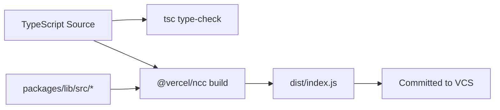
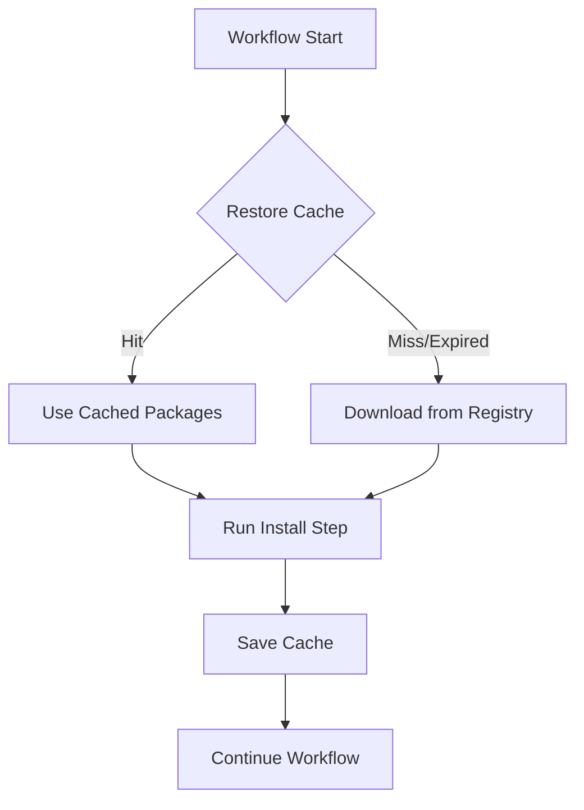
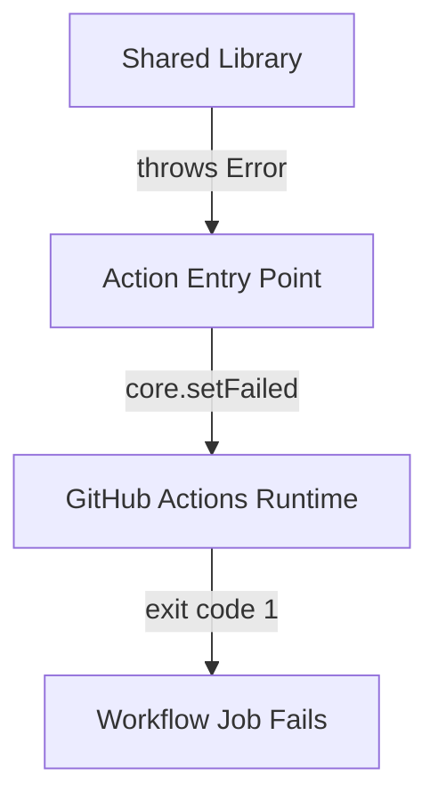

# Design Document

## Overview

This design describes the technical architecture for the LDK-Systems GitHub Actions monorepo (`LDK-Systems/actions`). The repository consolidates reusable workflows, composite actions, and JavaScript actions into a single npm workspace monorepo. Each JS action is written in TypeScript, compiled to a single distributable file using `@vercel/ncc`, and shares common utilities through an internal `@ldk-systems/lib` package.

The architecture follows GitHub's recommended layout for hosting multiple actions in one repository: each action lives in its own top-level directory with an `action.yml` metadata file, while reusable workflows reside in `.github/workflows/`. The build system uses npm workspaces to link internal dependencies, and Vitest provides the testing framework with workspace-aware configuration for merged coverage reporting.

### Key Design Decisions

| Decision | Choice | Rationale |
| --- | --- | --- |
| Package manager | npm workspaces | Constraint from requirements; native Node.js tooling, no extra dependencies |
| Bundler | @vercel/ncc | Industry standard for GitHub Actions; produces single-file output with all deps inlined |
| Test framework | Vitest | Native TypeScript support, fast execution, workspace-aware coverage, modern API |
| PBT library | fast-check | Mature property-based testing for JS/TS, integrates with Vitest |
| XML parser | fast-xml-parser | Zero native dependencies (ncc-compatible), TypeScript types included, well-maintained |
| GitHub API client | @actions/github (Octokit) | Official toolkit package, handles auth automatically in Actions context |
| Runtime | node20 | Current GitHub Actions supported runtime |
| Docker cache | BuildKit with GHA backend | Native integration with GitHub Actions cache, layer-level granularity |

## Architecture

The monorepo uses a flat structure where each JS action is a top-level directory (matching GitHub's action reference format `owner/repo/path@ref`) and shared code lives under `packages/`.

```mermaid
graph TB
    subgraph "Repository Root"
        direction TB
        RootPkg[package.json<br/>npm workspace root]
        TSConfig[tsconfig.base.json]
    end

    subgraph "JS Actions (top-level)"
        A1[extract-dotnet-version/]
        A2[check-release-version/]
        A3[generate-release-notes/]
    end

    subgraph "Shared Packages"
        Lib[packages/lib/<br/>@ldk-systems/lib]
    end

    subgraph "Reusable Workflows"
        W1[.github/workflows/dotnet-build.yml]
        W2[.github/workflows/release.yml]
        W3[.github/workflows/ci.yml]
    end

    A1 -->|imports| Lib
    A2 -->|imports| Lib
    A3 -->|imports| Lib
    RootPkg -->|workspaces| A1
    RootPkg -->|workspaces| A2
    RootPkg -->|workspaces| A3
    RootPkg -->|workspaces| Lib
```

### Directory Structure

```text
actions/
├── .github/
│   └── workflows/
│       ├── ci.yml                    # CI workflow for this repo
│       ├── dotnet-build.yml          # Reusable .NET build workflow
│       └── release.yml               # Reusable release workflow
├── extract-dotnet-version/
│   ├── action.yml                    # Action metadata (node20, dist/index.js)
│   ├── package.json                  # @ldk-systems/extract-dotnet-version
│   ├── src/
│   │   └── index.ts                  # Action entry point
│   ├── __tests__/
│   │   └── index.test.ts             # Unit + property tests
│   ├── dist/
│   │   └── index.js                  # ncc output (committed)
│   └── tsconfig.json                 # Extends base config
├── check-release-version/
│   ├── action.yml
│   ├── package.json                  # @ldk-systems/check-release-version
│   ├── src/
│   │   └── index.ts
│   ├── __tests__/
│   │   └── index.test.ts
│   ├── dist/
│   │   └── index.js
│   └── tsconfig.json
├── generate-release-notes/
│   ├── action.yml
│   ├── package.json                  # @ldk-systems/generate-release-notes
│   ├── src/
│   │   └── index.ts
│   ├── __tests__/
│   │   └── index.test.ts
│   ├── dist/
│   │   └── index.js
│   └── tsconfig.json
├── packages/
│   └── lib/
│       ├── package.json              # @ldk-systems/lib
│       ├── src/
│       │   ├── index.ts              # Re-exports all modules
│       │   ├── xml.ts                # XML parsing utilities
│       │   ├── github-api.ts         # GitHub API helpers (releases query)
│       │   ├── releases.ts           # Release creation utilities
│       │   └── template.ts           # Template rendering ({{key}} substitution)
│       ├── __tests__/
│       │   ├── xml.test.ts
│       │   ├── github-api.test.ts
│       │   ├── releases.test.ts
│       │   └── template.test.ts
│       └── tsconfig.json
├── package.json                      # Workspace root
├── package-lock.json
├── tsconfig.base.json                # Shared TypeScript config
└── vitest.workspace.ts               # Vitest workspace config
```

### Build Flow



Each action's build script runs `ncc build src/index.ts -o dist --source-map --license licenses.txt`. Because ncc resolves workspace dependencies at build time, the shared library code is inlined into each action's `dist/index.js`. This means actions are fully self-contained at runtime with no need for `node_modules`. If the bundler fails to inline the shared library, the build exits with a non-zero status code (Req 5.3, Req 6.6, Req 6.7).

### Dependency Caching Strategy



| Cache Type | Key Pattern | Restore Keys | Scope |
| --- | --- | --- | --- |
| npm | `npm-${{ runner.os }}-${{ hashFiles('package-lock.json') }}` | `npm-${{ runner.os }}-` | CI_Workflow |
| NuGet | `nuget-${{ runner.os }}-${{ hashFiles('**/*.csproj', '**/Directory.Packages.props') }}` | `nuget-${{ runner.os }}-` | DotNet_Build_Workflow |
| Docker BuildKit | `buildkit-${{ runner.os }}-${{ github.sha }}` | `buildkit-${{ runner.os }}-` | DotNet_Build_Workflow (when Docker enabled) |

Cache expiration or eviction is treated as a cache miss — the workflow performs a full restore from the remote registry and saves the result for future runs (Req 10.5).

## Components and Interfaces

### Shared Library (`@ldk-systems/lib`)

The shared library exposes four modules through a single entry point. All reusable logic lives here (Req 13.1); actions import from the library rather than implementing utilities inline.

```typescript
// packages/lib/src/index.ts
export { parseXmlElement, parseXmlDocument } from './xml';
export { getReleases, releaseExists } from './github-api';
export { createRelease } from './releases';
export { renderTemplate } from './template';
```

#### XML Parsing Module (`xml.ts`)

```typescript
import { XMLParser } from 'fast-xml-parser';

export interface ParseOptions {
  ignoreAttributes?: boolean;
}

/**
 * Parses an XML string and returns the parsed document object.
 * Throws if the input is not valid XML.
 */
export function parseXmlDocument(xml: string, options?: ParseOptions): Record<string, unknown>;

/**
 * Extracts the text content of a specific element by tag name
 * from a well-formed XML document string.
 * Returns undefined if the element is not found.
 */
export function parseXmlElement(xml: string, tagName: string): string | undefined;
```

#### GitHub API Module (`github-api.ts`)

```typescript
import { getOctokit } from '@actions/github';

export interface ReleaseInfo {
  id: number;
  tagName: string;
  name: string;
  url: string;
}

/**
 * Fetches all releases for a repository.
 * Throws on authentication or network errors.
 */
export function getReleases(token: string, owner: string, repo: string): Promise<ReleaseInfo[]>;

/**
 * Checks whether a release with the given tag exists.
 * Checks both the raw version and v-prefixed version.
 * Returns true if either tag form matches an existing release.
 */
export function releaseExists(
  token: string,
  owner: string,
  repo: string,
  version: string
): Promise<boolean>;
```

#### Release Creation Module (`releases.ts`)

```typescript
export interface CreateReleaseOptions {
  token: string;
  owner: string;
  repo: string;
  tag: string;
  name: string;
  body: string;
  draft?: boolean;
  prerelease?: boolean;
}

export interface CreateReleaseResult {
  id: number;
  url: string;
  htmlUrl: string;
}

/**
 * Creates a GitHub release with the specified parameters.
 * Defaults: draft=false, prerelease=false.
 * Throws on API errors (auth, network, conflict).
 */
export function createRelease(options: CreateReleaseOptions): Promise<CreateReleaseResult>;
```

#### Template Rendering Module (`template.ts`)

```typescript
/**
 * Replaces {{key}} placeholders in a template string with values
 * from the provided variables object. Unmatched placeholders are
 * left unchanged in the output. All non-placeholder text is preserved.
 */
export function renderTemplate(template: string, variables: Record<string, string>): string;
```

### JS Action: `extract-dotnet-version`

**Package:** `@ldk-systems/extract-dotnet-version`

```typescript
// extract-dotnet-version/src/index.ts
import * as core from '@actions/core';
import { parseXmlElement } from '@ldk-systems/lib';
import { readFileSync, existsSync } from 'fs';

async function run(): Promise<void> {
  const projectFile = core.getInput('project-file', { required: true });

  // 1. Check file existence (precedence over parse errors — Req 2.5)
  // 2. Read and parse the .csproj file as XML
  // 3. Extract Version, VersionPrefix, VersionSuffix elements
  // 4. Fail if none found (Req 2.6)
  // 5. Apply precedence: Version > VersionPrefix-VersionSuffix > VersionPrefix (Req 2.2-2.4)
  // 6. Set outputs: version, version-prefix, version-suffix
}
```

**action.yml inputs:** `project-file` (required)
**action.yml outputs:** `version`, `version-prefix`, `version-suffix`

### JS Action: `check-release-version`

**Package:** `@ldk-systems/check-release-version`

```typescript
// check-release-version/src/index.ts
import * as core from '@actions/core';
import { releaseExists } from '@ldk-systems/lib';

async function run(): Promise<void> {
  const version = core.getInput('version', { required: true });
  const repository = core.getInput('repository', { required: true });
  const token = core.getInput('token') || process.env.GITHUB_TOKEN || '';

  // 1. Validate inputs — fail immediately on first invalid input (Req 3.4)
  //    - version must be non-empty
  //    - repository must be owner/repo format
  // 2. Proceed to API call (token auth not validated upfront — Req 3.6)
  // 3. Call releaseExists checking both version and v-prefixed version
  // 4. Set output: exists (true/false)
}
```

**action.yml inputs:** `version` (required), `repository` (required), `token` (optional)
**action.yml outputs:** `exists`

### JS Action: `generate-release-notes`

**Package:** `@ldk-systems/generate-release-notes`

```typescript
// generate-release-notes/src/index.ts
import * as core from '@actions/core';
import { renderTemplate, createRelease } from '@ldk-systems/lib';

async function run(): Promise<void> {
  const template = core.getInput('template', { required: true });
  const templateVarsRaw = core.getInput('template-vars', { required: true });
  const version = core.getInput('version', { required: true });
  const repository = core.getInput('repository', { required: true });
  const token = core.getInput('token') || process.env.GITHUB_TOKEN || '';

  // 1. Validate inputs — fail immediately on first invalid input (Req 12.6)
  //    - version must be non-empty
  //    - repository must be owner/repo format
  // 2. Parse template-vars JSON — fail if not valid JSON object (Req 12.5)
  // 3. Render template with variables via shared lib (Req 12.9)
  // 4. Create release via shared lib (Req 13.2)
  //    - tag: version, name: version, body: rendered notes
  //    - draft: false, prerelease: false
  // 5. Set output: release-url
}
```

**action.yml inputs:** `template` (required), `template-vars` (required), `version` (required), `repository` (required), `token` (optional, defaults to GITHUB_TOKEN)
**action.yml outputs:** `release-url`

### Reusable Workflows

#### `.github/workflows/dotnet-build.yml`

```yaml
on:
  workflow_call:
    inputs:
      dotnet-version:
        required: true
        type: string
      project-path:
        required: true
        type: string
      configuration:
        required: false
        type: string
        default: 'Release'
      run-tests:
        required: false
        type: boolean
        default: true
      build-docker-image:
        required: false
        type: boolean
        default: false
      docker-image-name:
        required: false
        type: string
      dockerfile-path:
        required: false
        type: string
        default: './Dockerfile'
      docker-build-args:
        required: false
        type: string
```

**Job steps:**

1. Checkout
2. Setup .NET SDK (`dotnet-version`)
3. Cache NuGet packages (key from `*.csproj` + `Directory.Packages.props` hashes)
4. `dotnet restore`
5. `dotnet build` (with `configuration`)
6. `dotnet test` (conditional on `run-tests: true` and build success)
7. Validate Docker inputs (fail if `build-docker-image: true` but `docker-image-name` empty — Req 4.16)
8. Docker build with BuildKit cache (conditional on `build-docker-image: true` and build success)
   - Uses `docker/build-push-action` with `cache-from: type=gha` and `cache-to: type=gha,mode=max`
   - Tags image with `docker-image-name`
   - Passes `docker-build-args` if provided

#### `.github/workflows/release.yml`

```yaml
on:
  workflow_call:
    inputs:
      version:
        required: true
        type: string
      release-notes-template:
        required: true
        type: string
      template-vars:
        required: false
        type: string
        default: '{}'
    secrets:
      token:
        required: false
```

**Job steps:**

1. Checkout the actions monorepo (to access action code)
2. Run `check-release-version` action — must complete successfully before step 3 (Req 11.5)
3. Fail if version already exists (Req 11.8)
4. Run `generate-release-notes` action (conditional on version not existing)
   - Passes `release-notes-template`, `template-vars`, `version`
   - Repository derived from `github.repository` context of the caller (Req 11.10)

#### `.github/workflows/ci.yml`

```yaml
on:
  pull_request:
    branches: [main]

jobs:
  test:
    # 1. Checkout
    # 2. Setup Node.js
    # 3. Restore npm cache (key from package-lock.json hash)
    # 4. npm ci
    # 5. Save npm cache
    # 6. vitest run --coverage
  build:
    # 1. Checkout
    # 2. Setup Node.js
    # 3. Restore npm cache
    # 4. npm ci
    # 5. npm run build (all actions)
    # Triggered when action source or lib changes
```

## Data Models

### Action Metadata Schema (`action.yml`)

Each JS action follows this structure:

```yaml
name: '<Human-readable action name>'
description: '<Brief description>'
inputs:
  <input-name>:
    description: '<Input description>'
    required: true|false
    default: '<default value>'
outputs:
  <output-name>:
    description: '<Output description>'
runs:
  using: 'node20'
  main: 'dist/index.js'
```

### Package.json Structures

**Root workspace `package.json`:**

```json
{
  "name": "@ldk-systems/actions",
  "private": true,
  "workspaces": [
    "extract-dotnet-version",
    "check-release-version",
    "generate-release-notes",
    "packages/*"
  ],
  "scripts": {
    "build": "npm run build --workspaces --if-present",
    "test": "vitest run",
    "test:coverage": "vitest run --coverage",
    "typecheck": "tsc --build"
  },
  "devDependencies": {
    "@vercel/ncc": "^0.38.0",
    "typescript": "^5.4.0",
    "vitest": "^2.0.0",
    "@vitest/coverage-v8": "^2.0.0",
    "fast-check": "^3.0.0"
  }
}
```

**Action `package.json` (e.g., `extract-dotnet-version/package.json`):**

```json
{
  "name": "@ldk-systems/extract-dotnet-version",
  "version": "1.0.0",
  "private": true,
  "scripts": {
    "build": "ncc build src/index.ts -o dist --source-map --license licenses.txt"
  },
  "dependencies": {
    "@actions/core": "^1.10.0",
    "@ldk-systems/lib": "*"
  }
}
```

**Shared library `package.json` (`packages/lib/package.json`):**

```json
{
  "name": "@ldk-systems/lib",
  "version": "1.0.0",
  "private": true,
  "main": "src/index.ts",
  "types": "src/index.ts",
  "dependencies": {
    "@actions/core": "^1.10.0",
    "@actions/github": "^6.0.0",
    "fast-xml-parser": "^4.4.0"
  }
}
```

### TypeScript Configuration

**`tsconfig.base.json` (root):**

```json
{
  "compilerOptions": {
    "target": "ES2022",
    "module": "commonjs",
    "lib": ["ES2022"],
    "strict": true,
    "esModuleInterop": true,
    "skipLibCheck": true,
    "forceConsistentCasingInFileNames": true,
    "resolveJsonModule": true,
    "declaration": true,
    "declarationMap": true,
    "sourceMap": true,
    "outDir": "./dist",
    "rootDir": "./src"
  }
}
```

Each package extends this with `"extends": "../tsconfig.base.json"` (or `"../../tsconfig.base.json"` for `packages/lib`).

### Template Variables Schema

The `template-vars` input is a JSON object where all values are strings:

```typescript
// Valid: { "version": "1.2.3", "date": "2024-01-15", "author": "team" }
// Invalid: ["array"], "string", 42, null, { "nested": { "obj": true } }
type TemplateVars = Record<string, string>;
```

Template placeholders use `{{key}}` syntax. Unmatched placeholders remain in the output unchanged.

### Input Validation Rules

| Action | Input | Validation | Behaviour on Failure |
| --- | --- | --- | --- |
| Version_Extractor | `project-file` | File must exist on disk | Fail immediately (precedence over parse errors) |
| Version_Extractor | file content | Must be valid XML | Fail with "not valid XML" message |
| Version_Extractor | version elements | At least one of Version/VersionPrefix/VersionSuffix | Fail with "no version information" |
| Release_Checker | `version` | Non-empty string | Fail immediately on first invalid input |
| Release_Checker | `repository` | `owner/repo` format (two non-empty parts, one `/`) | Fail immediately on first invalid input |
| Release_Creator | `version` | Non-empty string | Fail immediately on first invalid input |
| Release_Creator | `repository` | `owner/repo` format | Fail immediately on first invalid input |
| Release_Creator | `template-vars` | Valid JSON, must be a plain object | Fail with "must be a JSON object" |

## Correctness Properties

*A property is a characteristic or behavior that should hold true across all valid executions of a system — essentially, a formal statement about what the system should do. Properties serve as the bridge between human-readable specifications and machine-verifiable correctness guarantees.*

### Property 1: Version extraction applies correct precedence rules

*For any* valid .csproj XML content containing any combination of `<Version>`, `<VersionPrefix>`, and `<VersionSuffix>` elements with arbitrary non-empty string values, the version extraction logic SHALL produce outputs that satisfy: (a) if `<Version>` is present, the `version` output equals its value regardless of other elements; (b) if only `<VersionPrefix>` and `<VersionSuffix>` are present, the `version` output equals `"{prefix}-{suffix}"`; (c) if only `<VersionPrefix>` is present, the `version` output equals the prefix value.

**Validates: Requirements 2.1, 2.2, 2.3, 2.4**

### Property 2: XML element extraction returns correct text content

*For any* well-formed XML document string and any tag name, if the document contains an element with that tag name, `parseXmlElement` SHALL return the text content of that element; if the document does not contain an element with that tag name, it SHALL return `undefined`.

**Validates: Requirements 5.4**

### Property 3: Template rendering substitution correctness

*For any* template string containing `{{key}}` placeholders and any `Record<string, string>` variables object, `renderTemplate` SHALL produce output where: (a) every placeholder `{{k}}` where `k` exists in the variables is replaced with `variables[k]`; (b) every placeholder `{{k}}` where `k` does NOT exist in the variables remains as the literal string `{{k}}` in the output; (c) all non-placeholder text is preserved unchanged.

**Validates: Requirements 5.7, 12.1, 12.8**

### Property 4: Release existence detection correctness

*For any* version string and any set of release tags in a repository, `releaseExists` SHALL return `true` if and only if the set contains a tag matching either the exact version string or the version string prefixed with `v`.

**Validates: Requirements 3.2, 3.3**

### Property 5: Repository input format validation

*For any* string that is not in the format of two non-empty strings separated by exactly one `/` character, both the Release_Checker and Release_Creator actions SHALL fail with an input validation error. *For any* string that IS in valid `owner/repo` format, the actions SHALL NOT fail due to input format validation.

**Validates: Requirements 3.4, 12.6**

### Property 6: Template variables JSON validation

*For any* string input to `template-vars`, if the string is not valid JSON or parses to a value that is not a plain object (i.e., is an array, string, number, boolean, or null), the Release_Creator SHALL fail with a validation error. *For any* string that parses to a valid JSON object with string values, the action SHALL NOT fail due to template-vars validation.

**Validates: Requirements 12.5**

## Error Handling

### Error Precedence Rules

Errors follow a strict precedence order within each action. The first applicable error condition halts execution:

**Version_Extractor precedence (Req 2.5):**

1. File does not exist → fail with "file not found" (highest priority)
2. File is not valid XML → fail with "not valid XML"
3. No version elements found → fail with "no version information"

**Release_Checker / Release_Creator precedence (Req 3.4, 12.6):**

1. First invalid input detected → fail immediately (version empty, or repository format invalid)
2. Token auth is NOT validated upfront — proceeds to API call (Req 3.6)
3. API errors (auth, network, not found) → fail with cause

### Error Propagation Strategy

All errors follow a fail-fast pattern. The shared library throws errors that bubble up to the action entry point, where `@actions/core.setFailed()` reports them to the GitHub Actions runtime.



### Error Categories

| Category | Source | Handling |
| --- | --- | --- |
| File not found | `fs.existsSync` / `fs.readFileSync` | Check existence first (Req 2.5), call `core.setFailed` with path |
| XML parse error | `fast-xml-parser` | Catch parser errors, report "not valid XML" |
| Missing version info | Version extraction logic | Detect absence of all version elements, fail explicitly |
| Invalid input format | Input validation | Validate before processing, fail on first invalid input (Req 3.4) |
| Invalid JSON | `JSON.parse` | Catch SyntaxError, report "template-vars is not valid JSON" |
| JSON not an object | Type check after parse | Check `typeof` and `!Array.isArray`, report "must be a JSON object" |
| GitHub API auth error | Octokit | Catch RequestError (401/403), report auth failure |
| GitHub API not found | Octokit | Catch RequestError (404), report repository not found |
| Network error | Octokit HTTP layer | Catch and report connectivity issue |
| Docker image name missing | Workflow validation | Fail if `build-docker-image: true` but no `docker-image-name` (Req 4.16) |

### Workflow Error Handling

- **DotNet_Build_Workflow:** Steps use `if: success()` for sequential failure propagation. Restore → Build → Test → Docker, each gated on prior success. Docker input validation (Req 4.16) runs before the Docker build step.
- **Release_Workflow:** Release_Checker must complete successfully before Release_Creator runs (Req 11.5). If version exists, workflow fails with explicit message (Req 11.8).
- **CI_Workflow:** Reports all failures as GitHub check status on the PR (Req 8.3, 8.4).

## Testing Strategy

### Framework Configuration

**Vitest** is the testing framework, chosen for native TypeScript support, fast execution, and workspace-aware coverage reporting.

**`vitest.workspace.ts` (root):**

```typescript
import { defineWorkspace } from 'vitest/config';

export default defineWorkspace([
  'packages/lib',
  'extract-dotnet-version',
  'check-release-version',
  'generate-release-notes',
]);
```

Each package has a local `vitest.config.ts`:

```typescript
import { defineConfig } from 'vitest/config';

export default defineConfig({
  test: {
    globals: true,
    coverage: {
      provider: 'v8',
      thresholds: { lines: 80 },
    },
  },
});
```

### Dual Testing Approach

| Test Type | Purpose | Tool |
| --- | --- | --- |
| Unit tests (example-based) | Specific scenarios, edge cases, error conditions | Vitest |
| Property-based tests | Universal properties across generated inputs | Vitest + fast-check |
| Integration tests | Workflow YAML validation, build output verification | Vitest + file assertions |

### Property-Based Testing Configuration

The property-based testing library is **fast-check**, integrated with Vitest.

- Minimum **100 iterations** per property test
- Each property test is tagged with a comment referencing the design property
- Tag format: **Feature: github-actions-monorepo, Property {number}: {property_text}**
- Each correctness property is implemented with a SINGLE property-based test

### Properties to Implement

1. **Version extraction precedence** — Generate random .csproj XML with various version element combinations; verify precedence rules produce correct outputs
2. **XML element extraction** — Generate random well-formed XML documents and tag names; verify correct content or undefined
3. **Template rendering** — Generate random template strings with `{{key}}` placeholders and variable maps; verify substitution correctness
4. **Release existence detection** — Generate random version strings and release tag sets; verify boolean result matches tag presence
5. **Repository input validation** — Generate random strings (valid and invalid `owner/repo` formats); verify acceptance/rejection
6. **Template-vars JSON validation** — Generate random strings (valid JSON objects, non-objects, invalid JSON); verify acceptance/rejection

### Mocking Strategy

| Dependency | Mock Approach | Used By |
| --- | --- | --- |
| File system (`fs`) | `vi.mock('fs')` — mock `existsSync`, `readFileSync` | Version_Extractor tests |
| `@actions/core` | `vi.mock('@actions/core')` — mock `getInput`, `setOutput`, `setFailed` | All action tests |
| `@actions/github` | `vi.mock('@actions/github')` — mock `getOctokit` return value | Release_Checker, Release_Creator, github-api, releases tests |
| Network/Octokit | Mock Octokit methods to return controlled responses | All API-dependent tests |

### Test Coverage Requirements

- Minimum **80% line coverage** across all workspace packages
- Coverage report generated on every test run via `@vitest/coverage-v8`
- CI workflow enforces coverage threshold (build fails if below 80%)

### Test Matrix

| Package | Unit Tests | Property Tests | Key Scenarios |
| --- | --- | --- | --- |
| `@ldk-systems/lib` (xml) | Parse valid XML, missing element, invalid XML | Property 2 | Edge cases: empty string, self-closing tags, nested elements |
| `@ldk-systems/lib` (template) | Basic substitution, no placeholders, empty template | Property 3 | Edge cases: adjacent placeholders, empty values, special chars in values |
| `@ldk-systems/lib` (github-api) | Fetch releases, release exists/not exists, API errors | Property 4 | v-prefix matching, empty tag list |
| `@ldk-systems/lib` (releases) | Create release success, API error propagation | — | Auth errors, network errors |
| `@ldk-systems/extract-dotnet-version` | All version combos, file not found, invalid XML, no version | Property 1 | Precedence: Version > Prefix-Suffix > Prefix |
| `@ldk-systems/check-release-version` | Existing release, non-existing, v-prefix, API errors | Property 5 | Invalid inputs: empty version, bad repo format |
| `@ldk-systems/generate-release-notes` | Valid template, missing inputs, invalid JSON, API errors | Properties 5, 6 | Non-object JSON (array, string, number, null) |
